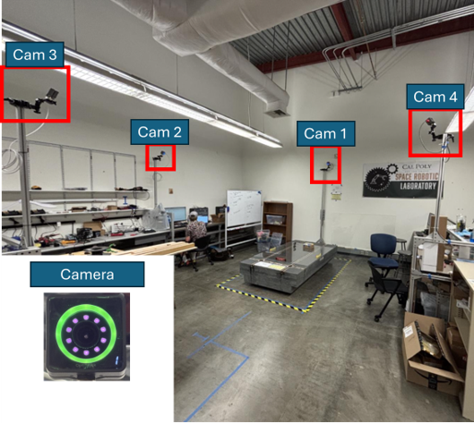

# Space-Robotics-Lab
Main Page for the CP SpaceRobotics Lab Organization

The Space Robotics Laboratory provides a teaching and research space that explores space, ground, and air electro-mechanical systems. Of particular interest are Floating Spacecraft Simulators that provide a hardware-in-the-loop platform for students to build, prototype and test simulated spacecraft in a simulated 3 Degree of Freedom frictionless environment (XY planar with Z rotation)

# People

Lab Director: Dr. Stephen Thiam-Choy Kwok-Choon

# Research Projects

# Conference Publications

1. “Design and Development of a Thrust Vectoring Floating Spacecraft Simulator” - Connell James Crawford, Gerelle De Castro Samaniego, Angel Cristobal Rodriguez Hernandez, Stephen Thiam-Choy Kwok-Choon, AIAA Student Conference Region VI, San Luis Obispo, March 2026 (https://doi.org/10.2514/6.2026-112371 ).
2. “A Prototype Low-Cost Hybrid-Actuated Mobile Spherical Terrain Exploration Rover” - Winnie Gao, Youyou Luo, Drew Schlauch, Stephen T. Kwok-Choon, IEEE Big Sky Technical Conference, Big Sky, Montana, March 2026 (https://doi.org/10.1109/AERO66936.2026.11520138 )
3. “Development of a 3 Degree of Freedom Manipulator for Use on a Planar Microgravity Testbed” - Jackson W. Cordova, Stephen T. Kwok-Choon, AIAA Student Conference Region VI, San Luis Obispo, March 2026 (https://doi.org/10.2514/6.2026-112374 )
4. “SpaceOTTER - Space Optically Tracked Testbed for Experiments and Research” - Alexander DeBartolo, Allegra Ciarlantini, Stephen Kwok-Choon, AIAA Student Conference Region VI, San Luis Obispo, March 2026 (https://doi.org/10.2514/6.2026-114590 )
5. “OpenMV RT1062 Camera AprilTag Detection Parameterization for Camera Vision Applications” -  David T. Forbes, Ezekiel Casuga, and Stephen Thiam-Choy Kwok-Choon, AIAA Student Conference Region VI, San Luis Obispo, March 2026 (https://doi.org/10.2514/6.2026-108977 )

# Completed Masters Thesis

1. Forbes, David, "DEVELOPMENT OF A COMPUTER VISION BASED RENDEZVOUS AND DOCKING TEST PLATFORM", M.S Aerospace Engineering Thesis, California Polytechnic State University - San Luis Obispo. June 2026.
2. Cordova, Jackson, "Development of a Free-Floating Space Robotic Simulator, TRUMAN: Terrestrial Robotic Unit for Multibody Analysis and Navigation", M.S Aerospace Engineering Thesis, California Polytechnic State University - San Luis Obispo. June 2026.
3. Gao, Winnie, “HYBRID-ACTUATED MOBILE SPHERICAL TERRAIN EXPLORATION ROVER (HAMSTER)”, M.S Aerospace Engineering Thesis, California Polytechnic State University - San Luis Obispo. June 2026.
4. DeBartolo, Alexander, “SpaceOTTER- Space Optically Tracked Testbed for Experiments and Research”, M.S. Aerospace Engineering Thesis, California Polytechnic State University – San Luis Obispo. June 2026.
